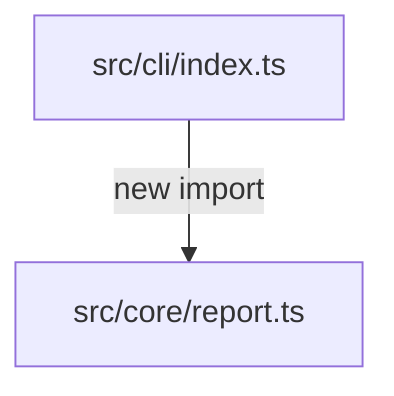

# Architecture Impact Report

> Example only. Generated reports separate detected structural facts from inferred risk and author-provided context.

## Summary of detected structural changes

- Base: `main`
- Head: `HEAD`
- Added files/modules: 1
- Removed files/modules: 0
- Changed files/modules: 2
- Added dependency edges: 1
- Removed dependency edges: 0

## Detected facts

### Added files or modules

- `src/core/report.ts`

### Added dependency edges

- `src/cli/index.ts -> src/core/report.ts (import)`

## Inferred risk signals

- **WARNING — Source changed without a detected test change**
  - ArchLens detected source/module changes but no test file changes in the compared snapshots.

## Mermaid dependency diagram

## Author-provided context

- No author note provided.

## Unknowns

- ArchLens does not know author intent.
- Risk signals are deterministic heuristics, not proof of bugs.
