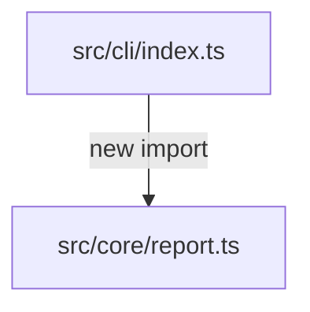

# Architecture Impact Report

> Example only. Generated reports separate detected structural facts from inferred risk and author-provided context.

## Summary of detected structural changes

- Base: `main`
- Head: `HEAD`
- Added files/modules: 1
- Removed files/modules: 0
- Changed files/modules: 2
- Added dependency edges: 1
- Removed dependency edges: 0

## Detected facts

### Added files or modules

- `src/core/report.ts (source, typescript)`

### Added dependency edges

- `src/cli/index.ts -> src/core/report.ts (import)`

## Inferred risk signals

- **WARNING — Source changed without a changed test file**
  - Source files changed, but ArchLens did not detect changed test files in this diff. Check the potential related tests section and verify coverage manually if behavior changed.

## Tests

### Changed test files

- None detected.

### Potential related existing tests

- `src/core/report.test.ts`

## Suggested review order

Risk-first, deterministic order: high-risk paths, config/workflow/deployment files, dependency-edge participants, changed source, tests, then docs.

- `src/cli/index.ts`
- `src/core/report.ts`

## Mermaid dependency diagram

## Author-provided context

- No author note provided.

## Unknowns

- ArchLens does not know author intent.
- Risk signals are deterministic heuristics, not proof of bugs.
